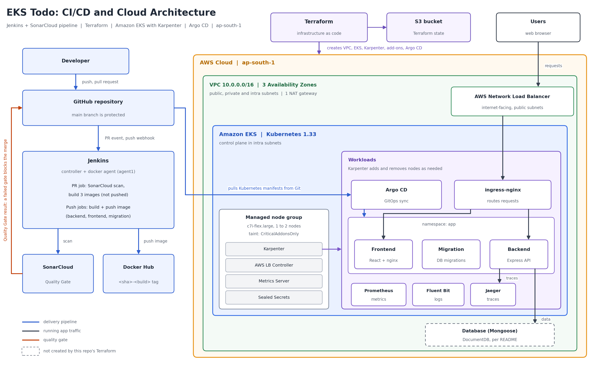
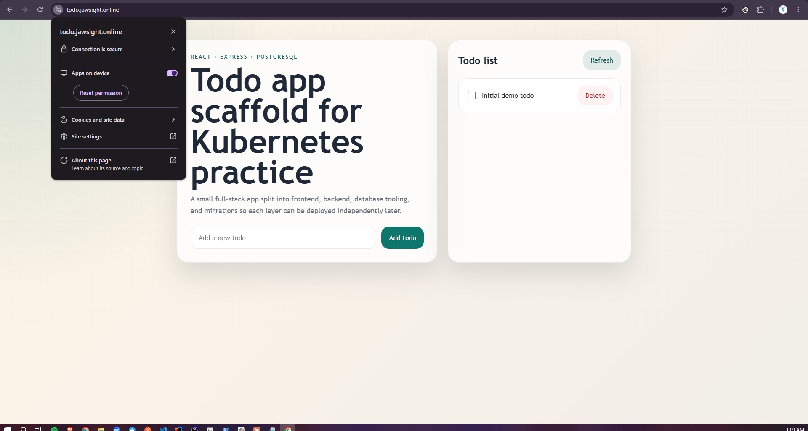
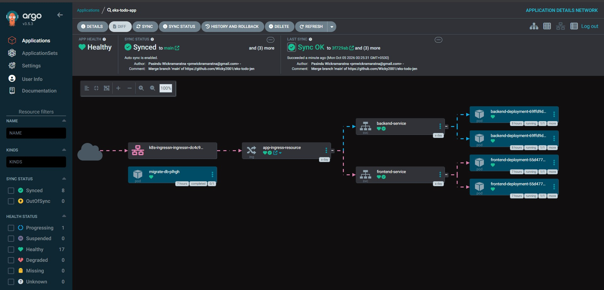
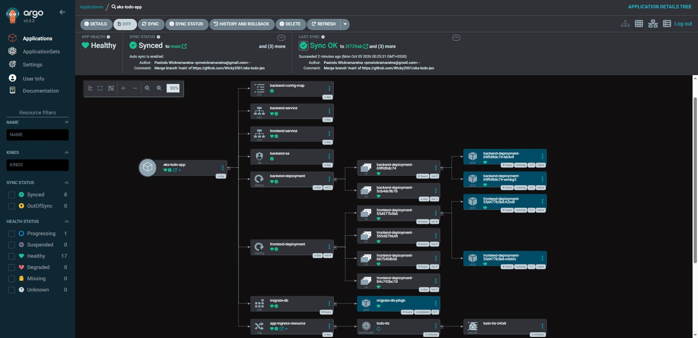

# EKS Todo — Jenkins CI/CD, GitOps with Argo CD, and HTTPS on Amazon EKS

A full-stack Todo app (React + Express + PostgreSQL) on **Amazon EKS**. **Jenkins** builds and scans every change, **Argo CD** deploys from Git, and **cert-manager** serves HTTPS with a **Let's Encrypt** certificate. A failed **SonarCloud** Quality Gate blocks the PR merge.

Live at **`https://todo.jawsight.online`** while the stack is running (torn down between sessions to save cost).

## Architecture



- **Terraform:** VPC, **EKS 1.33**, add-ons, **ECR** and **RDS**, with state in **S3**
- **Karpenter** starts nodes on demand. The **VPC CNI** uses prefix delegation for more pods per node.
- **NLB → ingress-nginx:** `/` to the frontend, `/api` to the backend
- **RDS PostgreSQL** in private subnets. The backend logs in with an **IAM token** through **EKS Pod Identity**, so no password is stored.
- **Prometheus + Grafana** for metrics, **Fluent Bit** for logs, **Jaeger** for traces

```
Browser ──HTTPS──► NLB ──► ingress-nginx (Let's Encrypt cert) ─┬─ "/"    → frontend pods
                                                               └─ "/api" → backend pods ──TLS──► RDS
```

## HTTPS with cert-manager and Let's Encrypt

A Namecheap **CNAME** points `todo.jawsight.online` to the NLB. **cert-manager** proves ownership to Let's Encrypt (HTTP-01), stores the certificate in a Kubernetes Secret, and renews it automatically. HTTP redirects to HTTPS.




## GitOps with Argo CD

Jenkins pushes images to **ECR** tagged with the commit SHA and commits the new tag to the [GitOps repo](https://github.com/Wicky2001/eks-todo-jenkins-gitops).  **Argo CD** syncs it to the cluster. The database migration Job runs in an earlier **sync wave**, so the backend updates only after the migration finishes.





## Pipelines

| Jenkinsfile | Trigger | Purpose |
|---|---|---|
| [`Jenkinsfile.pr`](jenkins/Jenkinsfile.pr) | Pull requests | SonarCloud scan + build all 3 images |
| [`Jenkinsfile.deploy`](jenkins/Jenkinsfile.deploy) | Push to `main` | Build and push changed images, update the manifests for Argo CD |

SonarCloud's Quality Gate check is **Required** in `main`'s branch protection. In the demo, PR #3 adds a file with deliberate vulnerabilities, and the merge is blocked:


## No long-lived keys

| Who | AWS access through |
|---|---|
| Backend, LB Controller, EBS CSI, Karpenter | **EKS Pod Identity** roles |
| Jenkins on EC2 | an **EC2 instance role** (ECR push only) |
| RDS admin password | **Secrets Manager**, managed by AWS |

Jenkins uses a **fine-grained GitHub token** with minimal permissions:


## Repository layout

| Folder | Description |
|---|---|
| [`frontend/`](frontend) · [`backend/`](backend) · [`migration/`](migration) | React UI, Express API, database migrations |
| [`jenkins/`](jenkins) | Jenkinsfiles and Jenkins images |
| [`k8s/`](k8s) | Kubernetes manifests (app, Argo CD, cert-manager, Karpenter, observability) |
| [`tf/`](tf) | Terraform for AWS and EKS |
| [`cloud-lesson-notes/`](cloud-lesson-notes) | How the pieces work, explained step by step |

## Run locally

```bash
npm install
# copy each *.env.example to *.env and adjust
docker compose up
```
