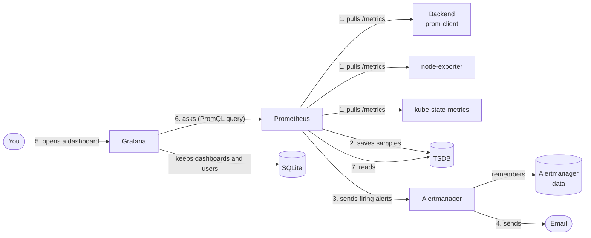

# Prometheus stack monitoring: prom-client, Prometheus, Alertmanager and Grafana

## In one minute

- The backend counts its own requests with the **prom-client** library and shows the numbers at `/metrics`.
- **Prometheus pulls** (scrapes) those numbers on a timer and saves them in its own database, the **TSDB**.
- **Grafana asks** Prometheus for numbers every time a dashboard opens. It never stores metrics itself.
- **Alertmanager** gets alerts from Prometheus and sends emails.
- Each tool has **its own disk**, because each one stores a different kind of data.

## The diagram

Every arrow points from **the one who acts** to **the one it acts on**.



## The boxes

| Box | What it is | Where it lives |
|---|---|---|
| **Backend, prom-client** | a Node.js library that counts requests (how many, how long) and serves them at `GET /metrics` | [`backend/src/app.js`](../backend/src/app.js), namespace `app` |
| **node-exporter** | one pod per node. Shows the node's CPU, memory, disk and network. | installed by kube-prometheus-stack |
| **kube-state-metrics** | shows the state of Kubernetes objects: pod restarts, desired vs ready replicas | installed by kube-prometheus-stack |
| **Prometheus** | visits every `/metrics` page on a timer, saves the numbers, and checks the alert rules | namespace `monitoring` |
| **Alertmanager** | groups firing alerts, stops repeats, sends the email | namespace `monitoring` |
| **Grafana** | draws dashboards from Prometheus data | namespace `monitoring` |

Two settings objects steer Prometheus:

| Object | Tells Prometheus | File |
|---|---|---|
| **ServiceMonitor** `backend-service-monitor` | "scrape the pods behind Services labelled `app: backend`, at `/metrics`" | [`service-monitor-rules.yml`](../k8s/observability/monitoring/manifests/prometheus/service-monitor-rules.yml) |
| **PrometheusRule** | "fire `HighCpuUsage` or `PodRestart` when these conditions hold" | [`alert-rules.yml`](../k8s/observability/monitoring/manifests/prometheus/alert-rules.yml) |

## The three databases

| Database | Stores | Disk | If it is lost |
|---|---|---|---|
| **Prometheus TSDB** | metric samples: name, labels, time, number. For example `http_requests_total{path="/api/todos"} = 1532 at 14:05:02`. | EBS 20 GiB, `prometheus-metrics-sc` | the metric history (new data starts again) |
| **Grafana SQLite** | Grafana's own settings: dashboards, users, data sources. **No metrics.** | EBS 10 GiB, `grafana-sc` | your dashboards and users |
| **Alertmanager data** | silences ("mute this alert until 6 pm") and who was already notified | EBS 10 GiB, `alertmanager-alerts-sc` | silences, and some emails repeat |

The storage classes are in [`storage-classes.yaml`](../k8s/observability/monitoring/storage-classes.yaml) and the disk sizes in [`helm-values.yaml`](../k8s/observability/monitoring/helm-values.yaml).

## Pull, not push

**Prometheus pulls from the apps.** The apps never send anything. Prometheus visits each `/metrics` page on a timer, like a person reading meters around a building on a schedule.

**Grafana pulls from Prometheus.** Prometheus never sends anything to Grafana. When you open or refresh a dashboard, Grafana sends a **PromQL** query, Prometheus reads its TSDB and answers, and Grafana draws the chart. When you close the page, the numbers are gone from Grafana. Grafana is a TV screen: it shows the broadcast but does not record it.

## Why Grafana cannot use the Prometheus database

1. **Wrong shape.** The TSDB only holds "a number at a time, with labels". It cannot hold a dashboard layout, a user or a password.
2. **One owner.** Only Prometheus writes to its TSDB, and it deletes old data on its own (retention). Grafana's dashboards would disappear.
3. **Many sources.** One Grafana can show Prometheus metrics, Elasticsearch logs and Jaeger traces side by side, so its settings need a home of its own.

## Check it on the real cluster

```bash
# the monitoring pods
kubectl get pods -n monitoring

# the three disks
kubectl get pvc -n monitoring

# what the backend shows Prometheus
kubectl port-forward svc/backend-service -n app 8081:8081
curl http://localhost:8081/metrics

# open Prometheus (Status → Targets shows what it scrapes)
kubectl port-forward svc/monitoring-kube-prometheus-prometheus -n monitoring 9090:9090

# open Grafana
kubectl port-forward svc/monitoring-grafana -n monitoring 3000:80
```

## Sources

- [Prometheus overview](https://prometheus.io/docs/introduction/overview/)
- [Prometheus storage (TSDB)](https://prometheus.io/docs/prometheus/latest/storage/)
- [Alertmanager](https://prometheus.io/docs/alerting/latest/alertmanager/)
- [Grafana database configuration](https://grafana.com/docs/grafana/latest/setup-grafana/configure-grafana/#database)
- [kube-prometheus-stack Helm chart](https://github.com/prometheus-community/helm-charts/tree/main/charts/kube-prometheus-stack)
- [prom-client](https://github.com/siimon/prom-client)
