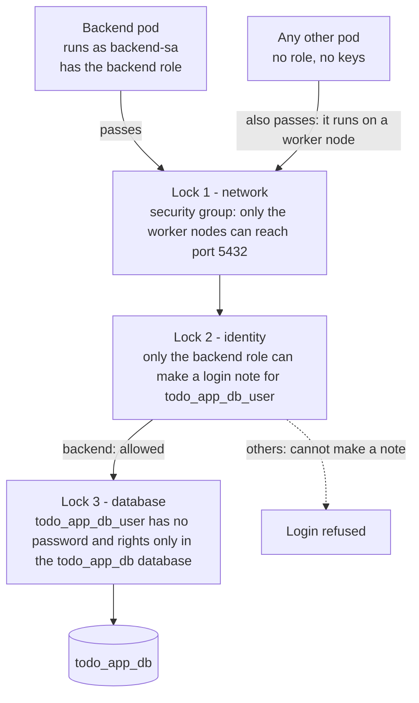
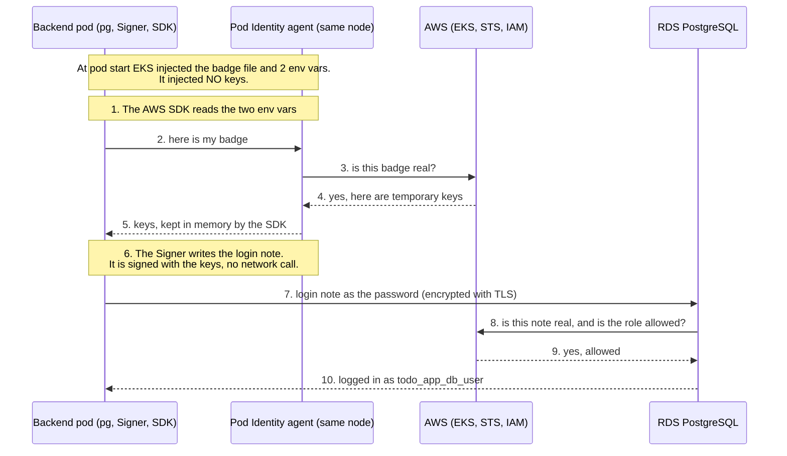
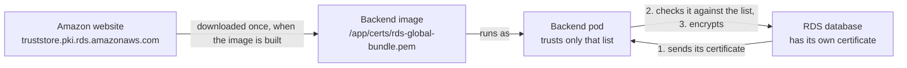
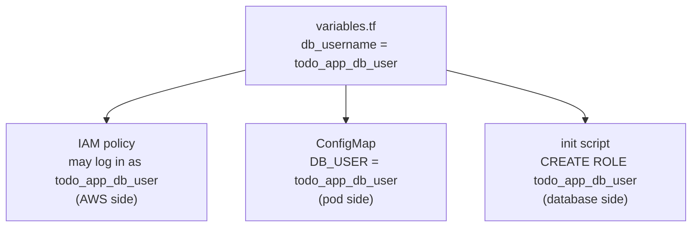
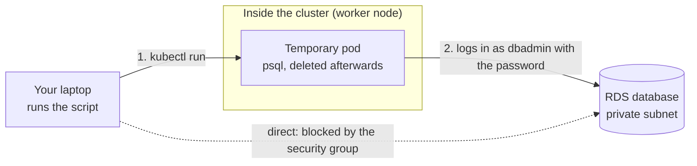
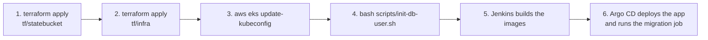

# How the backend logs in to RDS with IAM (no password)

This page explains how our backend pod connects to the PostgreSQL database in Amazon RDS **without any stored password**, and why only the backend can do it.

It is written for someone who remembers nothing. It builds on [EKS Pod Identity](eks-pod-identity-vs-irsa.md), which explains the badge, the agent and the associations. Read that page first if the words "Pod Identity" or "ServiceAccount" are new.

> **Status when this was written:** the application code was tested against a real local PostgreSQL, the login-token code was tested against a fake agent, and `terraform validate` passes. The AWS parts (creating RDS, the real IAM login, `scripts/init-db-user.sh`) had **not yet been run on real AWS**. Remove this note once they have.

---

## 1. The short version

1. EKS gives the backend pod a **badge**.
2. The pod swaps the badge for temporary AWS **keys**.
3. The **Signer** (a small library in our backend) uses the keys to write a **login note** that is valid for 15 minutes.
4. The login note is sent to RDS **as the password**.
5. RDS checks the note with AWS IAM and, if it is genuine, lets the pod in as the database user `todo_app_db_user`.

No password is stored anywhere in Git, in Kubernetes or in the pod.

---

## 2. Words you need

| Word | Plain meaning |
|---|---|
| **RDS** | Amazon's managed database service. AWS runs the server, we use it. |
| **PostgreSQL** | The database software. RDS runs a version of it that AWS has extended. |
| **Database server** | One RDS machine. It holds many databases and many database users. |
| **Database** | A set of tables inside the server. Ours is called `todo_app_db`. |
| **Database user** | A login name inside the server. We have `dbadmin` (the admin) and `todo_app_db_user` (used by the app). Do not mix these up with IAM users or roles: they are different things. |
| **IAM database authentication** | An RDS feature: instead of a password, a user logs in with a short-lived login note. Plain PostgreSQL does **not** have this. |
| **`rds_iam`** | A special role that RDS adds. A user who has it can log in **only** with a login note, never with a password. |
| **Signer** | A function from the AWS library `@aws-sdk/rds-signer`. It writes and signs the login note. |
| **TLS** | The encryption used on the connection. People still call it "SSL" out of habit. |
| **CA bundle** | A file listing the certificate authorities we trust for checking the database (see section 8). |

---

## 3. Three locks: why only the backend can get in



| Lock | What it checks | Where it is defined |
|---|---|---|
| **1. Network** | Only traffic from the worker nodes may reach port 5432 | `aws_security_group.rds` and `aws_vpc_security_group_ingress_rule.from_nodes` in [`main.tf`](../tf/infra/modules/rds/main.tf) |
| **2. Identity** | Only the IAM role given to `backend-sa` may ask for a login note for `todo_app_db_user`, on this one server | module `backend_pod_identity` in [`main.tf`](../tf/infra/modules/rds/main.tf) |
| **3. Database** | `todo_app_db_user` has no password at all and only has rights inside `todo_app_db` | [`scripts/init-db-user.sh`](../scripts/init-db-user.sh) |

Be honest about lock 1: every pod runs on a worker node, so another pod **can** reach the port. It is lock 2 that stops it, because other pods have no role, cannot make a login note, and no password exists to guess. (A stricter network lock per pod would need "security groups for pods" or a Kubernetes NetworkPolicy.)

What the IAM role really limits is **which server and which database user**. It does not name a database. The ARN in the policy looks like this:

```
arn:aws:rds-db:us-east-1:ACCOUNT:dbuser:<server id>/todo_app_db_user
                                         └ which server ┘ └ which user
```

What `todo_app_db_user` may do **inside** the server is decided by PostgreSQL itself, through the grants in the init script. One detail: by default PostgreSQL lets any user connect to any database, so `todo_app_db_user` could open the built-in `postgres` database, but it has no rights on anything in it. Our server only holds `todo_app_db` anyway.

---

## 4. Three things that look alike (and are not)

The word "token" is used for three different things, which causes most of the confusion. In this page they are called the badge, the keys and the login note.

| Name here | Real name | Who makes it | What it is for | How long it lasts |
|---|---|---|---|---|
| **Badge** | the injected token file | EKS, when the pod starts | proves "I am `backend-sa`". **Only the agent understands it.** | about 24 hours, renewed automatically by Kubernetes |
| **Keys** | temporary AWS keys (access key, secret key, session token) | AWS, through the agent | the only thing AWS and RDS trust for signing | short-lived, renewed automatically by the SDK |
| **Login note** | the RDS authentication token | our backend (the Signer), using the keys | used as the database password | 15 minutes |

- There is only **one file**: the badge. The login note is not a file, it is a piece of text in memory.
- The badge cannot be used on RDS. RDS only trusts things signed with AWS keys, and the badge contains nothing to sign with. The agent works as a translator: badge in, keys out.
- **Keys are not injected at pod start.** Only the badge and two environment variables are. The pod gets keys later, on request, because keys expire quickly while a pod can run for days.

---

## 5. The full login, step by step

At pod start, EKS puts exactly **three things** into the pod:

| What | Value |
|---|---|
| badge file | `/var/run/secrets/pods.eks.amazonaws.com/serviceaccount/eks-pod-identity-token` |
| env var 1: `AWS_CONTAINER_CREDENTIALS_FULL_URI` | `http://169.254.170.23/v1/credentials` (the agent's address) |
| env var 2: `AWS_CONTAINER_AUTHORIZATION_TOKEN_FILE` | the path of the badge file |

**No keys yet.** The pod gets them in steps 2 to 5 below.



Reading the diagram:

- **Steps 1 to 5** only exist to get keys. They use the badge and the agent. The pod never talks to STS itself.
- **Step 6** is a calculation inside the pod. No request is sent anywhere.
- **Steps 7 to 10** are the actual database login.
- The SDK keeps the keys until they are close to expiring, so most logins skip steps 2 to 5.
- The login note is only checked at the moment of connecting. The connection pool asks the Signer for a **new** note every time it opens a new connection.

---

## 6. The Signer in our code

The backend and the migration job both read these settings and build the connection the same way.

- Backend: [`backend/src/config/db.js`](../backend/src/config/db.js)
- Migration job: [`migration/db.js`](../migration/db.js)

The important part:

```js
if (process.env.DB_IAM_AUTH === 'true') {
  const { Signer } = require('@aws-sdk/rds-signer');
  const signer = new Signer({ hostname: host, port, username: user, region: required('AWS_REGION') });

  config.password = () => signer.getAuthToken();   // the password is a function: it runs for each new connection
} else {
  config.password = process.env.DB_PASSWORD;       // local development
}
```

You give the Signer four facts (server address, port, database user, region). `getAuthToken()` then:

1. asks the AWS SDK for keys (the SDK uses the env vars and the badge, steps 1 to 5 above), and
2. uses the secret key to **sign** a note saying "let `todo_app_db_user` log in to this server for 15 minutes".

"Signing" works like a signature on paper: only the pod has the secret key, so the signature proves the note really came from it. AWS can check it later.

---

## 7. What the database does with the login note

Plain PostgreSQL has no idea what IAM is. It only compares passwords. **RDS is AWS's extended version.** When IAM login is switched on (`iam_database_authentication_enabled = true` in [`main.tf`](../tf/infra/modules/rds/main.tf)), RDS adds the `rds_iam` role. For a user that has this role, RDS does **not** compare a stored password. It treats whatever you send as a login note and checks it with AWS IAM:

- Is the note genuine and not expired?
- Is the role that signed it allowed `rds-db:connect` as this user (the policy in [`main.tf`](../tf/infra/modules/rds/main.tf))?

RDS decides by **which user** is logging in, not by looking at the text. A normal user without `rds_iam` would still use a password.

- `todo_app_db_user` has `rds_iam`, so it logs in only with a login note.
- `dbadmin` was created by RDS with a password kept in AWS Secrets Manager. It never got `rds_iam`, so it logs in with that password. This is deliberate: someone has to be able to create `todo_app_db_user` in the first place, and it is your way back in if IAM login ever breaks.

Turning IAM login on for the server is therefore **not** "IAM is the only way in". It only makes IAM login *possible*. Which users use it is decided user by user.

Our local `docker-compose.yml` uses plain PostgreSQL, which has no such feature, so locally the app uses a normal password (`DB_IAM_AUTH=false`).

The backend's IAM role cannot read the admin password: its only permission is `rds-db:connect`.

### Limits and cautions (from the AWS documentation)

- **Memory.** AWS says IAM login needs roughly **300 to 1000 MiB of extra memory** on the database server for reliable connections, and warns burstable instances to watch for running out. Our `db.t4g.micro` has only 1 GiB in total. If logins become flaky or the database restarts, a bigger instance class (`db.t4g.small` or larger, set `instance_class` in [`main.tf`](../tf/infra/modules/rds/main.tf)) is the first thing to try.
- **Never give `rds_iam` to `dbadmin`.** For PostgreSQL, a user who has it **must** log in with a login note and can no longer use the password, even the master user. That would remove the way back in.
- **An AWS administrator can also make a note.** Anyone with AWS administrator permissions can reach the database without being named in the policy. The three locks protect against **pods**, not against your own admin account.
- **Auditing.** CloudWatch and CloudTrail do not log IAM database logins, so do not rely on them to see who connected.
- **Use the real RDS address.** The login note is made for the exact server address, so a custom DNS name (for example a Route 53 record) will not work as `DB_HOST`.
- **Access stays limited to what the database user can do.** AWS confirms that a role that logs in as `todo_app_db_user` can reach only what `todo_app_db_user` can reach.

---

## 8. TLS and the Amazon certificate list

**SSL vs TLS.** SSL is the old name. The old SSL versions are retired because they are insecure, and TLS is the modern replacement. The setting is still called `DB_SSL`, but it uses TLS.

**Why TLS is on.** For two reasons: to encrypt the connection, and to check that the server really is our database. The login note acts like a password, so it must never travel unencrypted. AWS's own description of IAM login also lists TLS-encrypted traffic as part of the feature, and we always connect with TLS in the cluster.

**How the database proves itself.** It is the same as a website. During the connection the database sends its **certificate**, signed by an Amazon authority. The backend checks that signature against a list of authorities it trusts, following the chain upward until it reaches one that is on the list. A browser does this with its built-in list.

**The list is a file we ship in the image.** Node's built-in trusted list does not include Amazon's database authorities, so we give it this file: `rds-global-bundle.pem`. It is downloaded from Amazon when the Docker image is built (an `ADD` line in [`backend/Dockerfile`](../backend/Dockerfile) and [`migration/Dockerfile`](../migration/Dockerfile)) and stored inside the image at `/app/certs/rds-global-bundle.pem`. Nothing is installed on your computer, and locally (`DB_SSL=false`) it is not used. It plays the same role as the cluster CA certificate in your kubeconfig.



---

## 9. Who creates what

| Thing | Created by | Where |
|---|---|---|
| RDS server, security group, subnets | Terraform | [`main.tf`](../tf/infra/modules/rds/main.tf) (`aws_db_instance.this` and friends) |
| The admin user `dbadmin` and its password | RDS itself (password kept in Secrets Manager) | `manage_master_user_password = true` in [`main.tf`](../tf/infra/modules/rds/main.tf) |
| The IAM role, its permission and the association | Terraform (the `eks-pod-identity` module) | module `backend_pod_identity` in [`main.tf`](../tf/infra/modules/rds/main.tf) |
| The ServiceAccount `backend-sa` | Argo CD, from Git | [`k8s/app/backend/service-account.yaml`](../k8s/app/backend/service-account.yaml) |
| The connection settings (`backend-db-config` ConfigMap) | Terraform (the database address only exists after RDS is built) | `kubernetes_config_map_v1.backend_db` in [`main.tf`](../tf/infra/modules/rds/main.tf) |
| **The database user `todo_app_db_user`** | **A script you run once** | [`scripts/init-db-user.sh`](../scripts/init-db-user.sh) |

The IAM policy only contains the **name** `todo_app_db_user` as text. It does not create the user. That is why the script exists. The name is written in one place and flows to three:



If you skip the script, the AWS side and the pod are correct, but the login fails because the user does not exist inside the database yet.

---

## 10. Creating the database user (the init script)

Terraform cannot do it: the database is in a private subnet that your laptop cannot reach, and creating users inside a database is a different job from creating AWS resources.

The script starts a **short-lived pod inside the cluster**. That pod runs on a worker node, so the security group lets it through. The pod logs in as `dbadmin` with the password, runs three SQL lines and is deleted.



What the SQL does:

| SQL | Meaning |
|---|---|
| `CREATE ROLE todo_app_db_user WITH LOGIN` | creates the user **with no password** |
| `GRANT rds_iam TO todo_app_db_user` | makes it a login-note-only user |
| `GRANT ALL ON SCHEMA public TO todo_app_db_user` | lets it create and use tables inside `todo_app_db` (the script connects to `todo_app_db`) |

Which identity does what:

| Who | Role in this step | What it needs |
|---|---|---|
| **You, with the `terraform-user` profile** | runs the script | read the Terraform outputs, read the admin password from Secrets Manager, and use `kubectl`. This profile created the cluster, so it is already a cluster admin (`enable_cluster_creator_admin_permissions = true`). |
| **The temporary pod** | does the SQL | no AWS role, only the admin password |
| **The backend pod** | not involved | nothing |

The script is safe to run again. Note that the admin password is passed to the temporary pod as an environment variable, so anyone with `kubectl` access to the `app` namespace could see it for the few seconds the pod exists. That is acceptable for a personal cluster, but tighten it on a shared one.

---

## 11. Local development vs the cluster

The same code runs in both. Only the settings differ.

| Setting | Local (`docker-compose.yml`, `.env.example`) | Cluster |
|---|---|---|
| `DB_HOST` | `db` (the container) | the RDS address, from the ConfigMap `backend-db-config` |
| `DB_PORT` | `5432` | `5432` |
| `DB_NAME` | `todos` | `todo_app_db` |
| `DB_USER` | `demo` | `todo_app_db_user` |
| `DB_PASSWORD` | `demo` | **not set** |
| `DB_IAM_AUTH` | `false` | `true` ([`k8s/app/backend/config-map.yaml`](../k8s/app/backend/config-map.yaml)) |
| `DB_SSL` | `false` | `true` |
| `DB_SSL_CA_FILE` | not needed | `/app/certs/rds-global-bundle.pem` |
| `AWS_REGION` | not needed | `us-east-1` (ConfigMap `backend-db-config`) |

Two different "IAM" settings exist, so do not confuse them:

- `iam_database_authentication_enabled` in Terraform is the **server** option: "IAM login is allowed".
- `DB_IAM_AUTH` is an **app** option: "use a login note instead of a password".

The code treats a missing `DB_SSL` or `DB_IAM_AUTH` as "off", so the defaults are the local ones. If someone forgot them in the cluster, the login would fail rather than silently work.

---

## 12. Setup order



Create the AWS profile first: `aws configure --profile terraform-user`. Terraform (state backend and providers), the init script and kubectl are all pinned to that profile name, so a different `AWS_PROFILE` set in your terminal no longer matters.

```bash
cd tf/statebucket && terraform init && terraform apply
cd ../infra && terraform init && terraform apply
aws eks update-kubeconfig --region us-east-1 --name todo-cluster --profile terraform-user
bash scripts/init-db-user.sh      # run once, from the repo root
```

If Argo CD ran the migration job **before** step 4, it failed because `todo_app_db_user` did not exist yet. Delete it so Argo CD recreates it:

```bash
kubectl delete job migrate-db -n app
```

The image tags in `k8s/app/*` point at images that do not exist in the new ECR until Jenkins has built them, so expect `ImagePullBackOff` until step 5 has run.

---

## 13. When something breaks

| Symptom | Likely cause | What to check |
|---|---|---|
| Backend logs say `DB_HOST is required` | The ConfigMap `backend-db-config` is missing | Did `terraform apply` finish? `kubectl get cm backend-db-config -n app` |
| The AWS library cannot find credentials | The pod was created before its association existed, or it runs as another ServiceAccount | `kubectl exec -n app deploy/backend-deployment -- env \| grep AWS_CONTAINER`. If nothing is printed, restart the pod: `kubectl rollout restart deploy/backend-deployment -n app` |
| The login is refused | The database user is missing or lacks `rds_iam` | Run `scripts/init-db-user.sh` again |
| A TLS error such as "unable to verify the first certificate" or "self-signed certificate in chain" | The CA file is missing or the path is wrong | Does `/app/certs/rds-global-bundle.pem` exist in the container? Is `DB_SSL_CA_FILE` correct? |
| The connection times out | The security group or subnets | Does the RDS security group allow the node security group on 5432? |
| The migration job fails on the first sync | It ran before the init script | `kubectl delete job migrate-db -n app` |
| The login is rejected although everything looks right | The signing region does not match the server | `AWS_REGION` in `backend-db-config` must be the RDS region |

Exact error texts differ between versions, so treat these as the usual suspects, not as quotes.

---

## 14. Questions you might be asked

**Why no database password in production?**
Passwords leak, get committed to Git and are rarely rotated. Here the pod gets temporary keys through its IAM role and signs a note that lasts 15 minutes. There is nothing to steal or rotate, and only pods running as `backend-sa` can get the role.

**What happens when the login note expires?**
Nothing happens to open connections. The note is only checked when a connection is opened, and the pool asks for a new one for each new connection.

**What does the Signer do?**
It writes a note ("let this user log in to this server for 15 minutes") and signs it with the pod's temporary secret key. It is a local calculation. AWS checks the signature later, when RDS asks IAM.

**Why does the pod need keys if it already has the badge?**
The badge only proves identity to the agent. AWS and RDS only trust signed requests made with AWS keys, so the agent swaps the badge for keys.

**Why not inject the keys at pod start?**
Keys expire quickly and a pod can run for days. With the badge the pod can fetch fresh keys whenever it needs them.

**Why is the admin still on a password?**
Someone has to create the first IAM-only user, and the admin is the way back in if IAM login breaks. The admin's password lives in Secrets Manager and the backend role cannot read it.

**Why are there three locks?**
Each stops a different thing: the security group stops anything outside the nodes, the IAM role stops other pods from making a login note, and the database user is passwordless and limited to one database.

**Where is the database user created, and why not in Terraform?**
By `scripts/init-db-user.sh`, run once. Terraform cannot reach the private database and manages AWS resources, not users inside a database.

**Why TLS, and what is the CA file?**
TLS encrypts the connection and checks that the server is really our database. The CA file lists the Amazon authorities we trust for that check. It is downloaded into the image at build time.

---

## 15. Sources

- [IAM database authentication for RDS (AWS docs)](https://docs.aws.amazon.com/AmazonRDS/latest/UserGuide/UsingWithRDS.IAMDBAuth.html)
- [Creating and using an IAM policy for IAM database access (AWS docs)](https://docs.aws.amazon.com/AmazonRDS/latest/UserGuide/UsingWithRDS.IAMDBAuth.IAMPolicy.html)
- [node-postgres: dynamic passwords via a callback function](https://node-postgres.com/features/connecting)
- [How EKS Pod Identity works (AWS docs)](https://docs.aws.amazon.com/eks/latest/userguide/pod-id-how-it-works.html)
