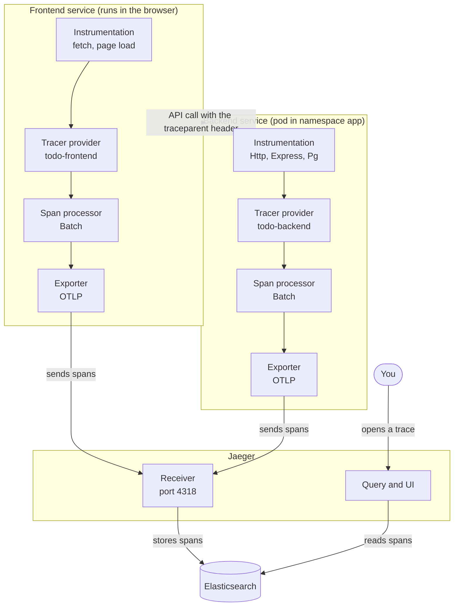

# Tracing: OpenTelemetry and Jaeger

## In one minute

- A **trace** is the complete journey of one request. A **span** is one step inside it.
- **OpenTelemetry** runs inside the frontend and the backend. It creates the spans and sends them out.
- **Jaeger** receives the spans, stores them in **Elasticsearch**, and shows each request as a timeline.
- To find what is slow, look at **self time**: the time a step spent on its own work, not waiting for its children.

---

## The components



The top two boxes are **OpenTelemetry**, running inside your own code. Jaeger and Elasticsearch are separate pods in the cluster.

| Component | Plain meaning |
|---|---|
| **Instrumentation** | plug-ins (`Http`, `Express`, `Pg`, browser `fetch`) that start and stop spans for you, so you write no tracing code |
| **Tracer provider** | the factory: gives each trace and span its ID, and adds `service.name` (`todo-frontend`, `todo-backend`) |
| **Span processor** | collects finished spans before sending. Both services use `Batch`: spans wait in a queue and go out in groups (every 5 s, or 512 at a time) instead of one network call per span. `Simple` would send each span on its own. |
| **Exporter** | sends the spans over the network in **OTLP**, the standard OpenTelemetry format |
| **Jaeger receiver** | accepts spans on port 4318 |
| **Elasticsearch** | stores the spans |
| **Query and UI** | reads the spans back and draws the timeline |

OpenTelemetry is the vendor-neutral standard and library. Jaeger is just one place to send traces to. Grafana Tempo or AWS X-Ray could replace it without changing the app code, only the exporter address.

Where it is in this repo:

| Service | Tracing setup | Sends spans to |
|---|---|---|
| Frontend | [`frontend/src/tracing.js`](../frontend/src/tracing.js), loaded in `main.jsx` | `VITE_OTEL_EXPORTER_ENDPOINT`, otherwise `http://localhost:4318/v1/traces` |
| Backend | [`backend/src/tracing.js`](../backend/src/tracing.js), loaded first in `server.js` | `OTEL_EXPORTER_JAEGER_ENDPOINT` from the backend ConfigMap (`http://jaeger.tracing.svc.cluster.local:4318/v1/traces`) |

Jaeger itself is installed by Terraform: [`tf/infra/modules/tracing`](../tf/infra/modules/tracing/main.tf) with the values in [`k8s/observability/tracing/jaeger-values.yaml`](../k8s/observability/tracing/jaeger-values.yaml). Traces have their **own Elasticsearch**, named `traces` in namespace `tracing` ([`k8s/observability/tracing/elasticsearch.yaml`](../k8s/observability/tracing/elasticsearch.yaml)), separate from the logs Elasticsearch in `logging`. A spike in one never slows down the other, and each can keep its data for a different time. Jaeger logs in as its own user, `jaeger-user`, which may only use the `jaeger-*` indices (not the `elastic` superuser). Terraform creates the user and a random password in the Secret `jaeger-user`. ECK puts the CA Secret in `tracing` too, so Jaeger, in the same namespace, verifies the certificate.

## Trace and span

> **Trace:** the complete journey of one request through all the services it touches, from start to finish. All its parts share one **trace ID**.
>
> **Span:** one step of that journey, for example one HTTP call or one database query. It has a name, a start time, an end time and a parent. Spans nest inside each other.

**An example anyone understands: tracking a parcel.**

```
Trace = one parcel's tracking number, ABC123 (the whole delivery)
 └─ Span: "picked up from seller"       10:00 – 10:30
 └─ Span: "at sorting centre"           11:00 – 14:00   ← slowest step
     └─ Span: "scanned"                 11:05 – 11:06
 └─ Span: "out for delivery"            15:00 – 17:00
```

Every step carries the same tracking number (the trace ID). Each step has a start and end time (a span). Looking at all of them shows where the delay was.

**In this app:** "the user clicks Add" is one trace. Its spans are the browser `fetch`, the backend HTTP request, the Express route and the SQL `INSERT`.

## How the trace ID travels from the frontend to the backend

The frontend adds one HTTP header to every `fetch` call (`propagateTraceHeaderCorsUrls` in `frontend/src/tracing.js`):

```
traceparent: 00-4bf92f3577b34da6a3ce929d0e0e4736-00f067aa0ba902b7-01
                └─────────── trace ID ───────────┘ └ parent span ┘
```

The backend's `Http` instrumentation reads it and continues the same trace instead of starting a new one. The header is a W3C standard called **Trace Context**.

## One trace as a timeline

The numbers are made up, to show the shape. Each bar is one span, and its length is how long it took.

```mermaid
gantt
  title One trace, "add a todo" (trace ID 4bf92f35...)
  dateFormat x
  axisFormat %L ms
  section Frontend
  fetch POST /api/todos (120 ms)  : 0, 120
  section Backend
  HTTP POST /api/todos (105 ms)   : 7, 112
  Express route (98 ms)           : 10, 108
  pg INSERT INTO todos (80 ms)    : 22, 102
```



The same as text:

```
time (ms)  0    7  10   22                     102 108 112   120
           │    │  │    │                        │   │   │     │
fetch      ├────┴──┴────┴────────────────────────┴───┴───┴─────┤  browser waits for the reply
HTTP            ├──┴────┴────────────────────────┴───┴───┤        backend request
Express            ├────┴────────────────────────┴───┤            your route code
pg INSERT               ├────────────────────────┤                database
```

The top bar, `fetch 120 ms`, is the time from the browser sending the request until the full reply came back to the frontend.

## Why the bars end at different points

Each outer step can only finish after its inner step finishes, and then it still has a little work left. So the inner bars always end earlier. Following the request step by step:

```
  0 ms  browser sends the request                          ← fetch STARTS
  7 ms  request arrives at the backend                     ← HTTP STARTS
 10 ms  Express runs your route                            ← Express STARTS
 22 ms  route sends the INSERT to PostgreSQL               ← pg STARTS
102 ms  database answers "done"                            ← pg ENDS      (first to end)
108 ms  route builds the JSON reply                        ← Express ENDS
112 ms  backend finishes writing the reply                 ← HTTP ENDS
120 ms  reply arrives back in the browser                  ← fetch ENDS   (last to end)
```

So the database ends first. The route still has to build the reply, the backend still has to send it, and the reply still has to travel back over the network. Each layer adds a bit of time after its child finishes.

It is like Russian nesting dolls: each span sits inside its parent, starting a bit later and ending a bit earlier. The rule:

```
parent.start  ≤  child.start   and   child.end  ≤  parent.end
```

If a child bar ever ended after its parent, that would mean a bug, for example something left running after the reply was already sent.

## The parent bar is not the sum of its children

A parent contains its children plus its own extra time:

```
fetch (browser)        120 ms = backend 105 ms + 15 ms network there and back
 └─ HTTP (backend)     105 ms = Express 98 ms + 7 ms reading the request, sending the reply
     └─ Express route   98 ms = database 80 ms + 18 ms your own code (validation, JSON)
         └─ pg INSERT   80 ms   (no children: all its own time)
```

If a span ran two queries at the same time, their bars would overlap and their sum could even be bigger than the parent.

## Finding what is slow: self time

The parent bar includes its children's time, so it does not show what that step alone cost. That is why tracing tools give a second number.

| Number | Meaning | Answers |
|---|---|---|
| **Duration** (total) | start to end of the span, including its children | "how long did this whole part take?" |
| **Self time** (exclusive) | duration minus the time spent in its children | "how much time did this step alone spend?" |

For the example:

| Span | Duration | Time in children | Self time | Where the self time went |
|---|---|---|---|---|
| fetch (browser) | 120 ms | 105 ms (HTTP) | **15 ms** | network, there and back |
| HTTP (backend) | 105 ms | 98 ms (Express) | **7 ms** | reading the request, writing the reply |
| Express route | 98 ms | 80 ms (pg) | **18 ms** | your code: validation, building JSON |
| pg INSERT | 80 ms | 0 | **80 ms** | the database |
| **Total** | | | **120 ms** | |

The self times add up to the total, 120 ms. That is the "who is responsible for how much" view, and it makes the answer obvious: the database, 80 of the 120 ms.

### Where to see it in the tools

- **Jaeger UI → open a trace → switch the view to "Trace Statistics".** It lists every operation with total and self-time columns. Sort by self time and the slowest step is at the top.
- **Critical path:** Jaeger highlights the critical path on the timeline: the chain of steps that actually decided the end time. Speeding up anything off that path would not make the request faster.
- **Grafana Tempo** and other tools show self time the same way.

### What teams look at

1. **The top bar (total duration)** is what the user feels. Alerts and goals use it, for example "95% of requests under 300 ms".
2. **Self time and the critical path** show where to fix it: the span with the biggest self time on the critical path.

The outer bar tells you there is a problem. Self time tells you where it is.

## What does not work yet

| Problem | Effect |
|---|---|
| The frontend sends to `localhost:4318` in production | in a visitor's browser that is their own computer, so frontend spans are lost. The usual fix is to expose Jaeger's OTLP endpoint through the Ingress, for example `https://todo.jawsight.online/otel`. |
| `"custom-attribute": "custom-value"` in `backend/src/tracing.js` | a leftover tutorial placeholder on every HTTP span |

## Interview questions

**What is the difference between a trace and a span?**
A trace is one request's whole journey across services. A span is one timed step in it. All spans of a trace share the trace ID.

**How does the trace continue from one service to the next?**
The caller sends the trace ID in the `traceparent` HTTP header (W3C Trace Context). The next service reads it and adds its spans to the same trace.

**What is OpenTelemetry, and what is Jaeger?**
OpenTelemetry is the standard and the library that creates and exports spans. Jaeger is a backend that receives, stores and shows them. You can swap Jaeger for another backend without changing the code.

**A request is slow. How do you find out why?**
Open its trace, look at the critical path, and find the span with the biggest self time.

## Sources

- [OpenTelemetry: traces](https://opentelemetry.io/docs/concepts/signals/traces/)
- [OpenTelemetry JavaScript](https://opentelemetry.io/docs/languages/js/)
- [W3C Trace Context](https://www.w3.org/TR/trace-context/)
- [Jaeger documentation](https://www.jaegertracing.io/docs/)
