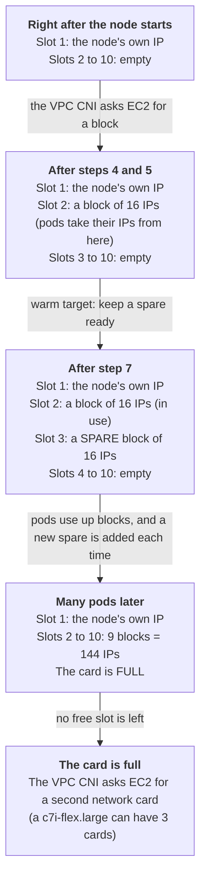
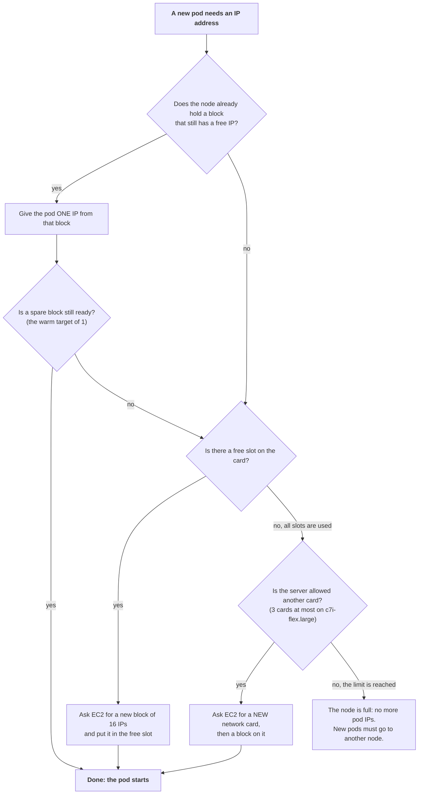

# VPC CNI and prefix delegation: how pods get their IP addresses

## In one minute

- Every pod needs **its own IP address** from our VPC.
- A small server has only **a few** addresses, so it can run only a few pods (**29** on our `c7i-flex.large`), even when its CPU and memory are almost idle.
- **Prefix delegation** hands the addresses out in **blocks of 16** instead of one by one. A node can then run many more pods.

---

## What is the VPC CNI?

- **CNI** = *Container Network Interface*. It is the plug-in that gives every pod a network address and connects the pod to the network.
- The **VPC CNI** is AWS's version. It gives each pod a **real address from our VPC subnet**, so a pod can talk to RDS, load balancers and other servers directly.
- It runs on **every node** as a DaemonSet pod called `aws-node`. We install it as the EKS add-on `vpc-cni`.
- It takes the addresses from the node's **network cards** (called ENIs) and asks the EC2 service for more when it needs them.

## The problem: a small server runs out of addresses

Each server type has a fixed number of network cards, and each card has a fixed number of address **slots**. Pods use those slots.

| Server | Cards × slots per card | Maximum pods |
|---|---|---|
| `t3.micro` | 2 × 2 | 4 |
| `t3.small` | 3 × 4 | 11 |
| **`c7i-flex.large` (ours)** | **3 × 10** | **29** |

```
max pods = cards × (slots − 1) + 2
```

- The "− 1" is the first slot of each card: it holds the card's own address, which pods never get.
- The "+ 2" is two system pods (`aws-node` and `kube-proxy`) that share the node's own address instead of needing one.

## What is prefix delegation, and why do we use it?

**What it is.** Each slot holds a **block of 16 addresses** (a "/28 prefix") instead of a single address. The block size is always 16 and cannot be changed. One card then holds its own address plus up to 9 blocks, which is **9 × 16 = 144** addresses.

**Why we use it.**
- Small, cheap servers can run many more pods. EKS then caps a managed node at **110** pods.
- Adding a block takes under a second, while adding a whole new card can take up to about 10 seconds (AWS).

**What it costs.**
- Unused addresses. AWS says to expect up to about 15 per node.
- Subnet space. Our private subnets are small (`/24`, about 250 addresses), so many nodes use them up faster.
- A block needs a free run of 16 addresses together in the subnet, so a very full subnet can fail to give one.
- It needs Nitro servers and VPC CNI 1.9.0 or newer.

**The warm target.** `WARM_PREFIX_TARGET = 1` means "always keep one spare block ready", so a new pod never waits for EC2.

## Our settings

In [`tf/infra/modules/eks/main.tf`](../tf/infra/modules/eks/main.tf), the `vpc-cni` add-on:

```hcl
vpc-cni = {
  before_compute = true            # create the add-on before the nodes, so they start with these settings
  configuration_values = jsonencode({
    env = {
      ENABLE_PREFIX_DELEGATION = "true"   # hand out blocks of 16
      WARM_PREFIX_TARGET       = "1"      # keep 1 spare block ready
    }
  })
  most_recent = true
}
```

---

## Diagram 1: what happens when a node starts

Green = EC2 (AWS) acts. Grey = it happens on the node.

```mermaid
flowchart TB
  subgraph WHERE["Where this happens: EKS cluster > private subnet > one worker node (EC2 server)"]
    S1["<b>STEP 1 - The node starts</b><br/>EC2 gives it ONE network card with ONE IP address (slot 1).<br/>This IP belongs to the node itself. Pods never get it."]
    S2["<b>STEP 2 - The VPC CNI pod starts</b><br/>It is the aws-node pod, one on every node.<br/>It needs no IP of its own: it uses the node's IP from step 1."]
    S3["<b>STEP 3 - The VPC CNI reads its settings</b><br/>ENABLE_PREFIX_DELEGATION = true: hand out blocks of 16 IPs, not single IPs.<br/>WARM_PREFIX_TARGET = 1: always keep 1 spare block ready."]
    S4["<b>STEP 4 - The VPC CNI asks EC2 for a block</b><br/>It calls the EC2 service: please put a block of 16 IPs on this card.<br/>It may ask because the node IAM role has the policy AmazonEKS_CNI_Policy."]
    S5["<b>STEP 5 - EC2 puts the block in a free slot</b><br/>The card now holds: slot 1 = the node IP, slot 2 = a block of 16 IPs."]
    S6["<b>STEP 6 - The first pod starts</b><br/>The VPC CNI gives it ONE IP from the block.<br/>The block now has 15 free IPs."]
    S7["<b>STEP 7 - The VPC CNI keeps a spare block ready</b><br/>Because the warm target is 1, it asks EC2 for one more block in another free slot.<br/>The next pods start fast."]
  end
  S1 --> S2 --> S3 --> S4 --> S5 --> S6 --> S7
  classDef aws fill:#d9f2ec,stroke:#0f6e56,color:#04342c
  classDef onnode fill:#f1efe8,stroke:#5f5e5a,color:#2c2c2a
  class S1,S5 aws
  class S2,S3,S4,S6,S7 onnode
```



## Diagram 2: how one network card fills up



In practice the 110-pod limit usually stops a node before the card is full.

## Diagram 3: what the VPC CNI does when a pod needs an IP (simplified)



---

## Words used above

| Word | Meaning |
|---|---|
| **Card (ENI)** | a virtual network card attached to the server |
| **Slot** | one address position on a card. A `c7i-flex.large` has 10 per card. |
| **Primary address** | the address in slot 1: the card's own address. Pods never get it. |
| **Block (prefix)** | 16 addresses together. One block fills one slot. |
| **Warm** | kept ready before it is needed |
| **Host networking** | a pod that shares the node's address instead of having its own (`aws-node`, `kube-proxy`) |

## Check it on the real cluster

```bash
# how many pods does each node allow?
kubectl get nodes -o custom-columns=NAME:.metadata.name,PODS:.status.capacity.pods

# cards and blocks attached to one server (use the real instance id)
aws ec2 describe-network-interfaces --profile terraform-user \
  --filters "Name=attachment.instance-id,Values=<instance-id>" \
  --query "NetworkInterfaces[].{Card:NetworkInterfaceId,Addresses:length(PrivateIpAddresses),Blocks:length(Ipv4Prefixes)}" \
  --output table
```

**Still to verify.** If a node that Karpenter created shows 29 pods, prefix delegation did not raise its limit. Karpenter works out the limit itself, and our `k8s/karpenter/karpenter-node-class.yaml` sets no `maxPods`. In that case add a `kubelet.maxPods` value there. This has not been tested on our cluster.

## Sources

- [Prefix mode for Linux (EKS best practices)](https://docs.aws.amazon.com/eks/latest/best-practices/prefix-mode-linux.html)
- [How maxPods is determined (Amazon EKS user guide)](https://docs.aws.amazon.com/eks/latest/userguide/choosing-instance-type.html)
- [Max pods per instance type (amazon-vpc-cni-k8s)](https://github.com/aws/amazon-vpc-cni-k8s/blob/master/misc/eni-max-pods.txt)
- [VPC CNI configuration variables (amazon-vpc-cni-k8s)](https://github.com/aws/amazon-vpc-cni-k8s)
- [CNI plugin and L-IPAM design (amazon-vpc-cni-k8s)](https://github.com/aws/amazon-vpc-cni-k8s/blob/master/docs/cni-proposal.md)
