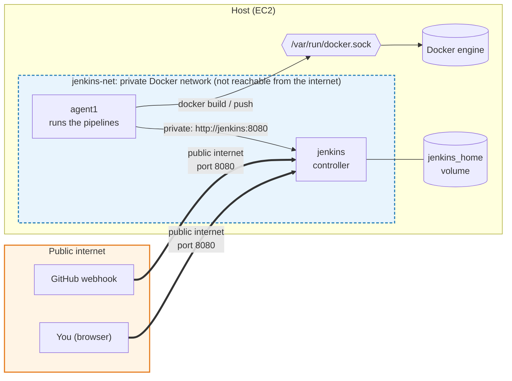
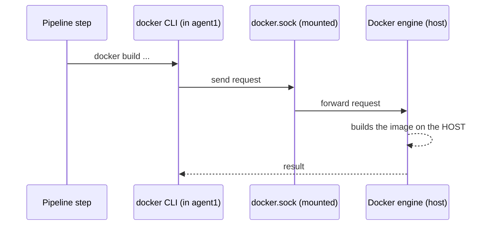
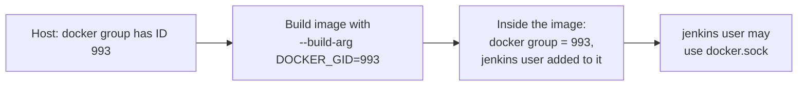
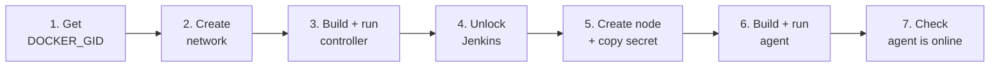
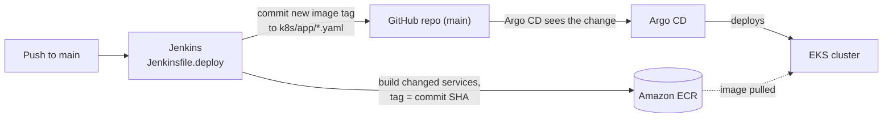
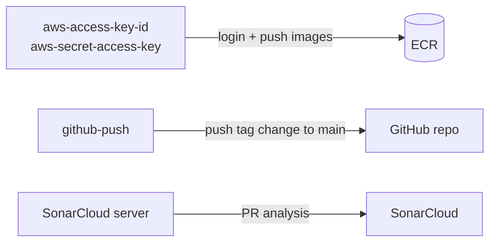

# Jenkins Setup Guide

Runs Jenkins on a Linux host as two containers: a **controller** (UI + scheduling) and an **agent** (runs the pipelines). Run everything from the repo root.

## Architecture



| Name | What |
|---|---|
| `jenkins-controller:latest` / `jenkins-agent:latest` | The two images |
| `jenkins` / `agent1` | The two containers (`agent1` is also the node name in Jenkins) |
| `jenkins-net` | Docker network they share |
| `jenkins_home` | Volume holding all Jenkins data |

## The Docker socket, simply

`docker build` is just a **CLI** that sends requests to the Docker **engine** through the file `/var/run/docker.sock`. Our images install only the CLI. Mounting the host's socket (`-v /var/run/docker.sock:/var/run/docker.sock`) plugs the **host's** engine into the container, so builds run on the host and no second engine is needed.



Linux checks socket permission by group **ID**, so `DOCKER_GID` must equal the host's `docker` group ID.



> ⚠️ Socket access is effectively root on the host. Only mount it into containers you trust.

## Setup



**1. Get the host's docker group ID** (used as `DOCKER_GID` below, examples use `993`)
```bash
getent group docker | cut -d: -f3
```

**2. Create the network**
```bash
docker network create jenkins-net
```

**3. Build and run the controller**
```bash
docker build -f jenkins/images/Dockerfile.controller --build-arg DOCKER_GID=993 -t jenkins-controller:latest jenkins/images
```
```bash
docker run -d \
  --name jenkins \
  --restart unless-stopped \
  --network jenkins-net \
  -p 8080:8080 \
  -v jenkins_home:/var/jenkins_home \
  -v /var/run/docker.sock:/var/run/docker.sock \
  jenkins-controller:latest
```

**4. Unlock Jenkins** at `http://<host-ip>:8080` with:
```bash
docker exec jenkins cat /var/jenkins_home/secrets/initialAdminPassword
```

**5. Create the agent node** (Manage Jenkins → Nodes → New Node): name `agent1`, Permanent Agent, remote root `/home/jenkins/agent1`, label `docker`, launch method "connect to the controller". Copy the **secret** it shows.

**6. Build and run the agent**
```bash
docker build -f jenkins/images/Dockerfile.agent --build-arg DOCKER_GID=993 -t jenkins-agent:latest jenkins/images
```
```bash
docker run -d \
  --name agent1 \
  --restart unless-stopped \
  --network jenkins-net \
  -v /var/run/docker.sock:/var/run/docker.sock \
  -e JENKINS_URL=http://jenkins:8080 \
  -e JENKINS_SECRET=<secret-from-step-5> \
  -e JENKINS_AGENT_NAME=agent1 \
  -e JENKINS_AGENT_WORKDIR=/home/jenkins/agent1 \
  jenkins-agent:latest
```
No space after each `\`.

**7. Check** — `agent1` should show **online** in Jenkins:
```bash
docker exec agent1 docker version
docker exec agent1 aws --version
```

## What the deploy pipeline does



## Jenkins credentials

Manage Jenkins → Credentials. IDs must match exactly.



| ID | Type | Value |
|---|---|---|
| `aws-access-key-id` | Secret text | Access key ID of IAM user `eks-todo-jenkins` |
| `aws-secret-access-key` | Secret text | Its secret key |
| `github-push` | Username with password | GitHub username + token (Contents: write) |

For `Jenkinsfile.pr`, add a SonarQube server named `SonarCloud` (Manage Jenkins → System).

## Jobs

| Job | Type | Script path |
|---|---|---|
| Deploy | Pipeline | `jenkins/Jenkinsfile.deploy` (GitHub push webhook, `main`) |
| PR checks | Multibranch | `jenkins/Jenkinsfile.pr` |

Webhook URL: `http://<host-ip>:8080/github-webhook/`

## Everyday

```bash
docker logs -f agent1        # logs
docker restart jenkins agent1
```

To update an image: rebuild it (step 3 or 6), `docker rm -f <container>`, run it again. Keep `-v jenkins_home:...` on the controller. **Never** `docker volume rm jenkins_home`, since it holds all jobs and credentials.

## Troubleshooting

| Problem | Fix |
|---|---|
| `permission denied ... docker.sock` | `DOCKER_GID` doesn't match the host. Redo step 1 and rebuild. |
| Agent offline | `docker logs agent1`. Check the secret, the node name, and that both containers are on `jenkins-net`. |
| `docker run requires at least 1 argument` | A line break without `\` split the command. |
| Agent secret leaked | Delete the node and create one with a new name. |

**Security:** allow port `8080` only from your IP plus [GitHub's webhook ranges](https://api.github.com/meta) (`hooks`). Never open `50000`.
