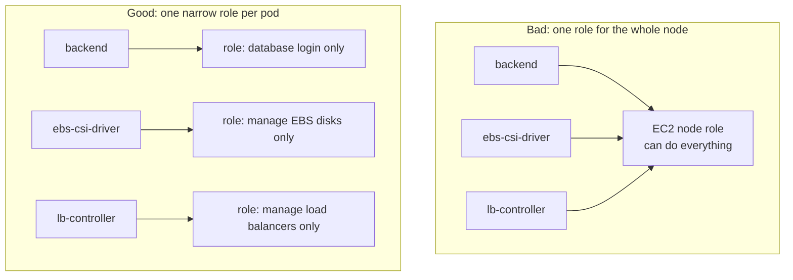
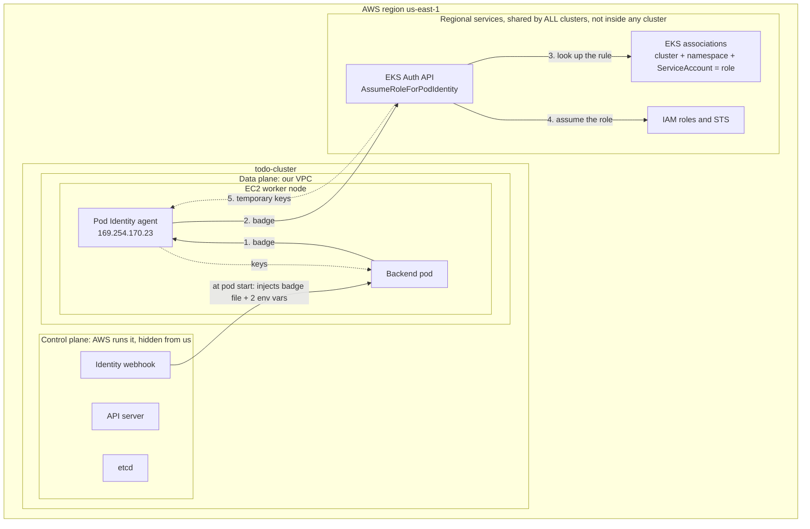
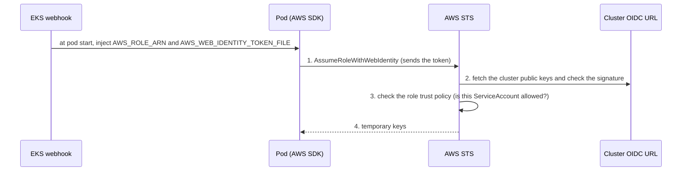
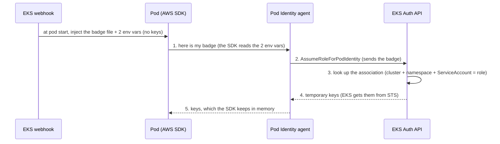

# EKS Pod Identity (and why we do not use IRSA)

This page explains how a pod in our cluster gets permission to use AWS services, such as creating a disk, creating a load balancer or logging in to the database.

It is written for someone who remembers nothing. Read it top to bottom once, and use the glossary when a word is unfamiliar.

The next page builds on this one: [How the backend logs in to RDS with IAM](../rds/README.md).

---

## 1. Words you need

| Word | Plain meaning |
|---|---|
| **AWS region** | A physical AWS location. Ours is `us-east-1`. |
| **EKS** | The AWS service that creates and runs Kubernetes clusters for you. It is bigger than one cluster: it also offers services that every cluster in the region shares (see section 3). |
| **Cluster** | One Kubernetes installation. Ours is called `todo-cluster`. |
| **Control plane** | The "brain" of the cluster. **AWS runs it and hides it from you.** It contains the API server (what `kubectl` talks to), etcd (the database of everything you created) and some helpers, such as the webhook that injects things into pods. |
| **Data plane** | The EC2 servers (worker nodes) in our VPC where pods actually run. |
| **Pod** | One running copy of an app, for example the backend. |
| **Namespace** | A folder inside the cluster. Ours: `app`, `kube-system`, `argocd`, `monitoring`. |
| **ServiceAccount** | The identity a pod runs as **inside Kubernetes**, like a user account for a program. If you do not choose one, the pod runs as `default`. Our backend runs as `backend-sa`. |
| **IAM role** | A set of AWS permissions that has no password. Whoever is allowed to "assume" it receives temporary keys. |
| **STS** | The AWS service that hands out those temporary keys. |
| **Temporary keys** | An access key, a secret key and a session token that expire after a while. |
| **Trust policy** | A rule written on an IAM role that says who is allowed to use the role. |
| **Association** | (Pod Identity only) A rule stored in EKS that says: "pods in this namespace that run as this ServiceAccount get this role". |
| **Agent** | A small program that runs on every worker node and hands pods their keys. |

---

## 2. The problem

Some pods need AWS permissions. For example:

- the EBS driver must create disks,
- the load balancer controller must create load balancers,
- Karpenter must start EC2 servers,
- the backend must log in to the database.

Bad ways to do it:

- **Put access keys inside the pod.** Keys never expire, and they leak.
- **Give the EC2 node a role.** Every pod on that node would get every permission.

What we want is **one narrow role per pod**, with no stored secret.



AWS gives two ways to do the "good" version:

| | IRSA | Pod Identity |
|---|---|---|
| Full name | **I**AM **R**oles for **S**ervice **A**ccounts | EKS Pod Identity |
| Introduced | 2019 (the old way) | late 2023 (the new way) |
| Used here? | No | **Yes** |

---

## 3. Where everything lives

A common confusion is "is EKS inside my cluster?". The answer is: **part of it is, and part of it is not.**



Who does what:

| Piece | Where it lives | Its job |
|---|---|---|
| **Identity webhook** | Control plane (hidden, run by AWS) | When a pod is created, it adds the credentials setup to the pod. **This is the "EKS injects things" part.** |
| **Pod Identity agent** | A pod on every worker node (a DaemonSet) | Receives the pod's badge and fetches keys for it. We install it as an EKS add-on (`eks-pod-identity-agent`). |
| **Associations** | Inside EKS (AWS side) | The rules "this ServiceAccount gets that role". **They are not Kubernetes objects**, so `kubectl` cannot show them. |
| **EKS Auth API** | One regional endpoint shared by all clusters | Checks the badge, looks up the association and returns keys. |
| **IAM and STS** | AWS | Hold the roles and issue the temporary keys. |

Two small notes:

- EKS also creates a private certificate authority for each cluster. That is why Terraform needs `cluster_ca_certificate`: it is the list of authorities used to check that the API server is really our cluster.
- You can never log in to the control plane machines, but you use them constantly: every `kubectl` command goes to the API server.

---

## 4. IRSA: the old way

### What the letters mean

**IRSA** = **I**AM **R**oles for **S**ervice **A**ccounts. The idea: link a Kubernetes ServiceAccount to an IAM role, so any pod using that ServiceAccount gets the role's permissions.

### The words it brings with it

- **OIDC** (OpenID Connect) is a standard way to hand out a signed ID card, called a token. In IRSA the **cluster** hands each pod such a token, saying "I am ServiceAccount `backend-sa` in namespace `app`".
- **The cluster's OIDC URL** is a web address that every EKS cluster has, for example `https://oidc.eks.us-east-1.amazonaws.com/id/A1B2C3...`. It publishes the cluster's public keys so others can check the token's signature. The part after `/id/` is random and **different for every cluster**.
- **OIDC provider (in IAM).** Before AWS will believe the cluster's tokens, you must register that URL in IAM once per cluster ("I trust ID cards from this URL").
- **The trust policy** of the role must mention the long OIDC URL **and** the exact ServiceAccount name.

### How IRSA works



### What you must wire by hand

1. Register the cluster's OIDC URL in IAM (once per cluster).
2. Create the role with a long trust policy that contains that URL and the ServiceAccount name:

   ```json
   {
     "Effect": "Allow",
     "Action": "sts:AssumeRoleWithWebIdentity",
     "Principal": { "Federated": "arn:aws:iam::ACCOUNT:oidc-provider/oidc.eks.us-east-1.amazonaws.com/id/A1B2C3..." },
     "Condition": { "StringEquals": {
       "oidc.eks.us-east-1.amazonaws.com/id/A1B2C3...:sub": "system:serviceaccount:app:backend-sa"
     } }
   }
   ```

3. Put the role on the ServiceAccount as an annotation:

   ```yaml
   apiVersion: v1
   kind: ServiceAccount
   metadata:
     name: backend-sa
     namespace: app
     annotations:
       eks.amazonaws.com/role-arn: arn:aws:iam::ACCOUNT:role/backend-role
   ```

4. Make the pod use that ServiceAccount.

The annotation only says "I would like this role". The trust policy is AWS saying "yes". **Both must match exactly.**

### Why it is painful

- The OIDC URL is different for every cluster, so the trust policy cannot be reused between clusters.
- One typo in the long trust policy (namespace, ServiceAccount name, the URL) gives a vague "not authorized" error.
- Three separate places must agree: the IAM provider, the trust policy and the Kubernetes annotation.

---

## 5. Pod Identity: the new way

### The idea

Remove the ID-card check. Instead, **EKS itself vouches for the pod**, because EKS already knows which pods run in the cluster. There is no OIDC URL to register and no long trust policy.

There are two parts:

1. **The agent** (EKS add-on `eks-pod-identity-agent`). It runs on every node. We install it in [`main.tf`](main.tf).
2. **An association**: a rule stored in EKS that says "ServiceAccount `X` in namespace `Y` on cluster `Z` gets role `R`".

### The role's trust policy is short and the same everywhere

```json
{
  "Effect": "Allow",
  "Principal": { "Service": "pods.eks.amazonaws.com" },
  "Action": ["sts:AssumeRole", "sts:TagSession"]
}
```

`pods.eks.amazonaws.com` simply means "the EKS Pod Identity service". The terraform-aws-modules `eks-pod-identity` module writes this policy for us.

### Creating the association

By hand it is one command:

```bash
aws eks create-pod-identity-association \
  --cluster-name todo-cluster --namespace app \
  --service-account backend-sa \
  --role-arn arn:aws:iam::ACCOUNT:role/backend-role
```

In this repo the `eks-pod-identity` Terraform module does it (role, permissions and association together).

The ServiceAccount stays **plain**, with no annotation:

```yaml
apiVersion: v1
kind: ServiceAccount
metadata:
  name: backend-sa
  namespace: app
```

### An association is an address, not something that is created

The association only stores **names**. It does not create the ServiceAccount, and the pods use it only if their namespace **and** ServiceAccount match.

| Pod | Gets the EBS role? |
|---|---|
| EBS CSI controller (namespace `kube-system`, ServiceAccount `ebs-csi-controller-sa`) | **Yes** |
| CoreDNS (`kube-system`, ServiceAccount `coredns`) | No, different ServiceAccount |
| A pod in `app` using a ServiceAccount with the same name | No, different namespace |

The ServiceAccount itself is created by whoever installs the software: the EBS add-on creates `ebs-csi-controller-sa`, the Helm chart creates `aws-load-balancer-controller-sa`, and we write `backend-sa` ourselves in [`k8s/app/backend/service-account.yaml`](../../../../k8s/app/backend/service-account.yaml).

### What EKS puts in the pod (and what it does not)

When a pod is created and its ServiceAccount has an association, EKS adds exactly **three things**:

| What | Value | Purpose |
|---|---|---|
| env var `AWS_CONTAINER_CREDENTIALS_FULL_URI` | `http://169.254.170.23/v1/credentials` | The agent's address. It only works from inside the same node. |
| env var `AWS_CONTAINER_AUTHORIZATION_TOKEN_FILE` | `/var/run/secrets/pods.eks.amazonaws.com/serviceaccount/eks-pod-identity-token` | Where the badge file is. |
| the **badge file** (a token file) | proves "I am ServiceAccount `X` in namespace `Y` of cluster `Z`" | Shown to the agent to get keys. It lasts about 24 hours and Kubernetes renews it. |

> **No keys are injected.** The pod starts with no keys at all. It gets them later, on request, by showing the badge. Keys expire quickly while a pod can run for days, so it fetches fresh ones whenever the old ones run out.

This injection happens **only when the pod is created**. A pod that was created before its association existed never gets these three things, and must be restarted.

### How it works



Details worth knowing:

- The AWS SDK inside the pod does steps 1 and 5 by itself. App code never touches the badge.
- The agent calls the EKS Auth API using the **node's** IAM role, which needs the permission `eks-auth:AssumeRoleForPodIdentity` (it is included in AWS's `AmazonEKSWorkerNodePolicy`). That only lets the agent ask. **Which** role the pod gets is decided by the badge plus the association, so a node cannot pick any role it likes.
- If the SDK already has valid keys in memory, it does not ask again.

---

## 6. IRSA vs Pod Identity

| | IRSA | Pod Identity |
|---|---|---|
| Who vouches for the pod | its signed token, checked through the cluster's OIDC URL | EKS itself, through the agent |
| One-time setup per cluster | register the OIDC provider in IAM | install the agent add-on |
| Role's trust policy | long, contains the OIDC URL and ServiceAccount, **different per cluster** | short and **identical for every cluster** |
| Linking ServiceAccount and role | an annotation on the ServiceAccount | an association stored in EKS |
| Same role in several clusters | not without editing the trust policy | yes |
| Where to see the links | scattered (IAM, annotations) | `aws eks list-pod-identity-associations` |
| Minimum Kubernetes version | 1.13 | 1.24 (ours is 1.33) |

Why we chose Pod Identity: fewer manual steps that can go wrong, a reusable role, and AWS recommends it for new workloads.

Honest caveats:

- IRSA is not broken. AWS treats the two as roughly equivalent.
- Pod Identity needs the agent running on the nodes and an AWS SDK recent enough to understand the container credentials provider.
- A few tools only support IRSA, though this is rare now.

---

## 7. How this repo uses it

| Who needs AWS permission | ServiceAccount (namespace) | Defined in |
|---|---|---|
| EBS CSI driver (creates disks) | `ebs-csi-controller-sa` (`kube-system`) | [`main.tf`](main.tf): module `aws_ebs_csi_pod_identity`, plus `pod_identity_association` on the `aws-ebs-csi-driver` add-on |
| AWS Load Balancer Controller | `aws-load-balancer-controller-sa` (`kube-system`) | [`../addons/main.tf`](../addons/main.tf): module `aws_lb_controller_pod_identity` |
| Karpenter (starts EC2 servers) | `karpenter` (`kube-system`) | [`../karpenter/main.tf`](../karpenter/main.tf): `create_pod_identity_association = true` |
| Backend and migration job (log in to RDS) | `backend-sa` (`app`) | [`../rds/main.tf`](../rds/main.tf): module `backend_pod_identity` |

The agent itself is the `eks-pod-identity-agent` add-on in [`main.tf`](main.tf) (`before_compute = true`, so it exists before the first worker node starts).

---

## 8. Gotchas we hit

1. **Order matters.** The association must exist **before** the pod is created. Otherwise the pod never gets the credentials and needs a restart (`kubectl rollout restart ...`). That is why the Helm releases and the Argo CD module wait for the associations with `depends_on`.
2. **An association needs the cluster to exist.** If you give it the cluster name as a plain string (`var.cluster_name`), Terraform does not know it must wait for the cluster. Reference something from the cluster (for example `module.eks.cluster_name`), or put the module call after the cluster.
3. **`depends_on` inside the EKS module's `addons` map is silently ignored**, and so is any key it does not know (a typo such as `pod_identity_assoiation`). No error is shown, the setting just does nothing.
4. **Do not create the same association twice.** For the EBS add-on we use `pod_identity_association` on the add-on and **no** `associations` on the `eks-pod-identity` module. A ServiceAccount can only have one association.
5. **Role names get a random ending.** The module uses a name prefix by default, so the role is called `todo-cluster-backend-iam-<random digits>`. Search by the prefix, or read the Terraform output.

---

## 9. Handy commands

```bash
# Which associations exist? (they are NOT visible with kubectl)
aws eks list-pod-identity-associations --cluster-name todo-cluster

# Is the agent running on every node?
kubectl get daemonset eks-pod-identity-agent -n kube-system

# Did my pod receive the injected variables? (nothing printed = no association when the pod was created)
kubectl exec -n app deploy/backend-deployment -- env | grep AWS_CONTAINER

# Which ServiceAccount does a pod run as?
kubectl get pod -n app -o custom-columns=NAME:.metadata.name,SA:.spec.serviceAccountName
```

---

## 10. Sources

- [How EKS Pod Identity works (AWS docs)](https://docs.aws.amazon.com/eks/latest/userguide/pod-id-how-it-works.html)
- [IAM roles for service accounts (AWS docs)](https://docs.aws.amazon.com/eks/latest/userguide/iam-roles-for-service-accounts.html)
- [Amazon EKS Pod Identity announcement (AWS blog)](https://aws.amazon.com/blogs/containers/amazon-eks-pod-identity-a-new-way-for-applications-on-eks-to-obtain-iam-credentials/)
